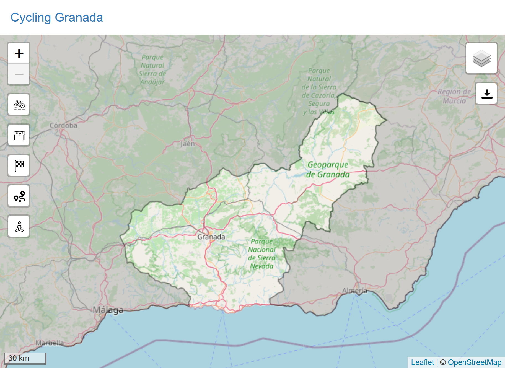

# Cycling Granada

## Routing web app for cyclists in Granada (Spain)

This final degree project has as main aim to develop a routing service for bicycles for the province of Granada (Spain). This service aims to provide a tool that encourages active cycling, allowing to find a safe cycling route that suits the type of bicycle used. Additionally, it allows users to download GPX route files to be used on other devices. This service provides a multiplatform access that can be used regardless of the device or browser from which it is accessed.